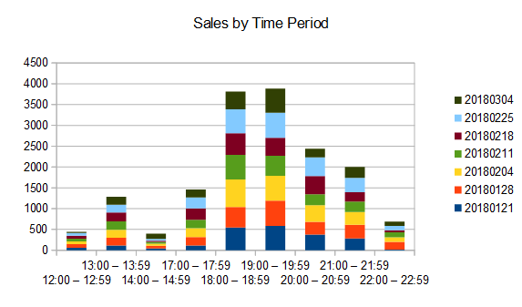
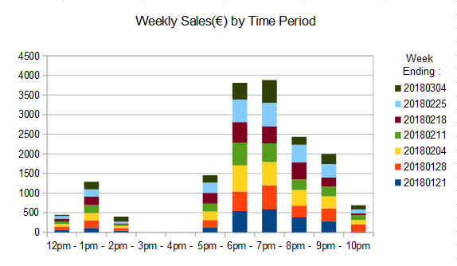
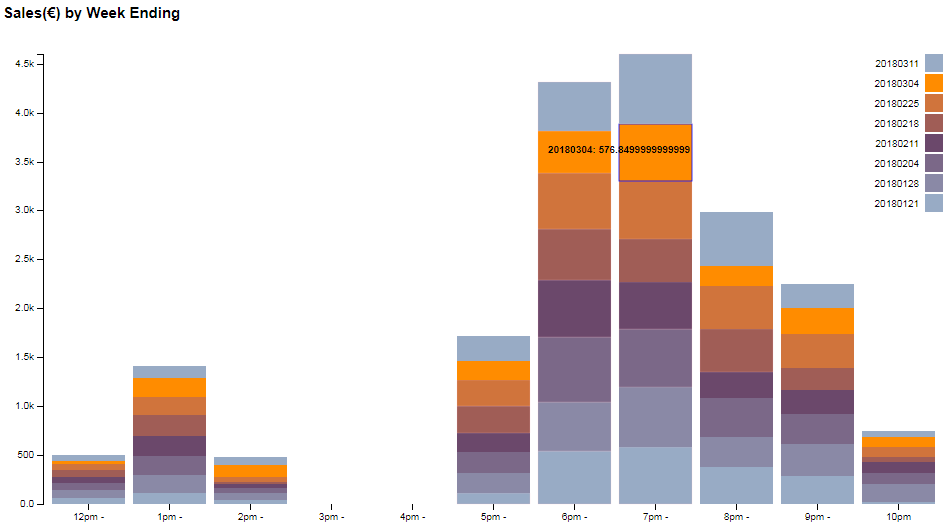
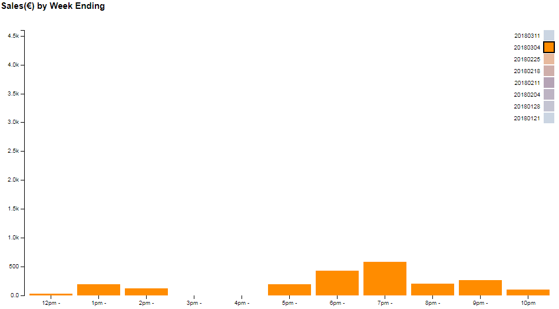
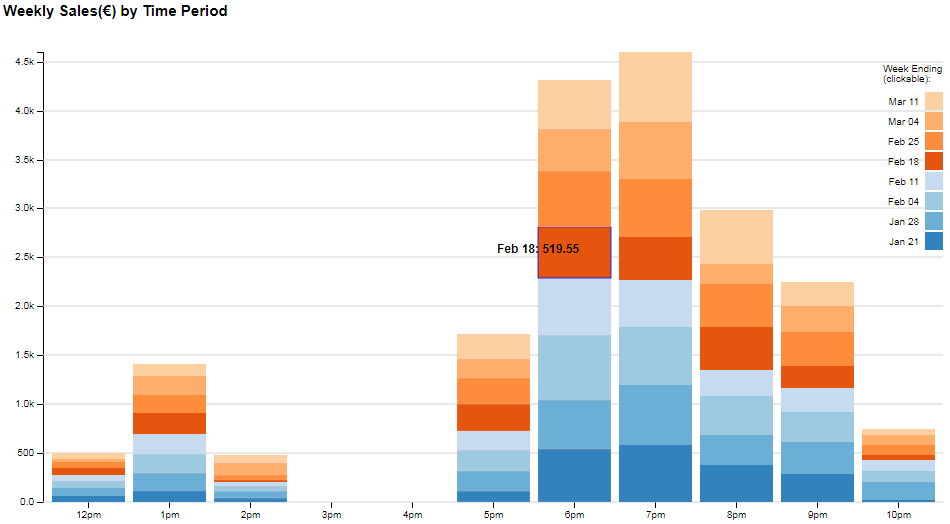

Sales Visualisation Project
=============================================================================

##Introduction

  The goal of this project is to visually represent the sales (by time period)
of a small take away in Ireland.  The dataset (times.csv) is a tidy dataset 
containing sales data in Euros from the last (at time of writing) seven weeks,
organised by time period.  By emphasising busy or successful time periods, I
hope to aid management make decisions about possibly altering opening 
hours.  Currently the take away opens from 12:30pm to 2:30pm, and from 5:30pm
to 10:30pm.

-----------------------------------------------------------------------------

##Design

  I chose a stacked bar chart to represent the data, as a bar chart should be
a good choice for comparing the data and showing it's distribution.  A stacked
bar chart should also allow me to show the composition of the data.  I began by
sketching the chart using OpenOffice Calc :

  Sharing the sketch I got feedback that it wasn't clear if the y axis 
represented sales volume or sales value, or what the legend represents.  I 
also thought the x axis labels were too hard to read.  My final sketch is 
below : 

  I think this still needs improvement; the colours are too busy and while they
make it easy to see composition, I think I it could be better.  I had hoped to 
show trends without losing this detail using animation and interactivity, but 
the type of animation I'd hoped to do proved to be difficult to implement. Instead, 
I focused on making it interactive.  I implemented a stacked bar chart 
that shows the data values of each bar segment as you hover over it (note - 8 
weeks of data are available at this point) : 

The legend is also clickable and shows the values for individual weeks when 
clicked on :

One fault I can see with the chart is the use of colour; seven colours in the 
palette is hard coded, so the colours are starting to be repeated.  I might fix
this is the short term by using a scaling colour palette, but at some point a
stacked bar chart will not be a good solution as the quantity of data points 
available grow.

Something that annoys me at this point is that once you click on an individual 
week, it stays selected.  It has to be unselected before you can click on 
another week.  I'm not going to do anything about this or other issues now, 
until after I get feedback on the chart.

-----------------------------------------------------------------------------

##Feedback

My first reviewer is a manager in the take away and gave no useful feedback.  
By observing her however, I did gain some useful insights.  She didn't interact
with the chart at all.  I plan to make it more obvious that individual weeks 
are clickable; adding "clickable" as a label if necessary.

My second reviewer is an IT support manager and gave the following feedback :

> Review:
Functionality is good, data is presented clearly. Business owner would be able to easily identify times of peak sales. 

> Suggested updates:

>Date format clarity - include slashes or use format DDMMMyy to give char for Month. 

>Rounding on blocks. Mouseover provides unrounded double value of the block. Round to 2 significant digits.

>Multiple selections. - include ability to select multiple segments

>Make the week total number visible on the page, this number changes when each block is selected, to relevant figure.

The first two suggestions should be easy to implement.  The last suggestion is 
something I was thinking of doing anyway but is not without it's cons.  She 
means making the total sales for the period displayed visible on the page.  I 
was thinking of adding this as a second chart with just one bar on the page, 
but because it's scale would have to be totally different, I'm not sure an 
intuitive comparison would be easy.  I think if I add the horizontal grid lines
suggested below, an estimate of the total would be easy to do, and beyond that 
the person would have to look at the data for an exact number.

My last reviewer is a recent data science graduate and gave the following 
feedback :

>I like that it's not trying to show too many things in one chart (like when there are multiple axes and lines as well as bars),

>Is it possible to supress the "-" after the times in the x axis "12pm" instead of "12pm -"?

>I dunno if it's just me, but I like to know if the 12pm stack is 11am-12pm or 12pm-1pm, or is it supposed to be obvious. It would probably look very cluttered if you tried to label it like that though so maybe you should just leave it as just the hour.

>Does there need to be an explanation for why there are no sales for 3pm and 4pm? And the fact that 12pm, 2pm, 5pm and 10pm are only half-hour slots whereas the rest are full hours? Some way to highlight the opening hours...maybe with background colours? Or just a sub-heading for the chart?

>I would like to see what it looks like with some background horizontal gridlines coming across from the labels on the Y axis. I find it hard to gauge if the 7pm sales are just below 4K or are hitting the 4K mark.

A lot of her suggestions about making things more obvious to people with less
domain knowledge are probably valid, but this chart will only be used by people
with domain knowledge.  I like the idea of subtly altering the background 
colour to indicate the hours that the take away is open, but it may be 
difficult to implement.  If I can fulfill the goal of this project without 
spending too much time on these issues, I'm not going to.  I do plan to 
implement her last suggestion.

One thing that wasn't suggested was to add a horizontal line at the point 
where it becomes profitable for the take away to be open.  I don't have data 
for where this line should be, so I can't add this feature.

-----------------------------------------------------------------------------

##Summary

This is a screenshot of my current webpage :

I've implemented some, but not all of the feedback received, and also made some
improvements based on observing a user.  There's still some things that could 
be improved in the chart - adding the text "clickable" seems a bit inelegant 
for example - but I think the chart fulfills the goal of the project.  I've also
changed the colour scheme to d3 categoryc for better contrast with the text.

The chart shows two peaks, corresponding to 'lunch time' and 'dinner time'. The 
left hand peak is pretty low, and though the bars next to it actually represent
only a half hour each, I think this would lead management to question if it's 
worth being open during these hours at all.

There's more data points on the right hand peak, and it's also wider, with 6pm 
and 7pm both showing high volumes of sales.  The right hand side seems to 
dwindle to almost nothing, suggesting that it's not worthwhile to be open 
later, and possibly even a good idea to close earlier. The left hand side of 
the right peak is higher than expected, especially considering the 5pm bar 
also represents just a half hour.  This may suggest it would be a good idea 
to open earlier.

Clicking on individual weeks shows these trend are repeated week after week.

-----------------------------------------------------------------------------

##Resources

I used KatiRG's interactive stacked bar chart example as a starting point : 
http://bl.ocks.org/KatiRG/5f168b5c884b1f9c36a5

Horizontal grid line code based on example :
http://www.d3noob.org/2013/01/adding-grid-lines-to-d3js-graph.html